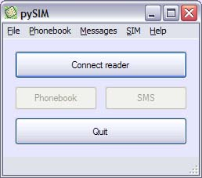

# pySimReader

This is the source code for the pySimReader application. It requires a PCSC
compatible SIM reader to be attached to the computer.

The main product page is here:
http://twhiteman.netfirms.com/pySIM.html

You can download the Windows installer from here:
https://github.com/toddw-as/SimReader/blob/master/installer/pySimReader_v14_setup.exe?raw=true

The application uses Python for the user interface and data processing, as well
as a binary Python module (DLL) to utilize the Microsoft SmartCard Base
Component APIs (note that if I were to rewrite this code today, I'd probably
utilize Python ctypes instead of this wrapper library - as that would simplify
the build process - removing the Microsoft Visual Studio and Swig dependencies).

## Screenshot

## License

GPL - GNU General Public License

## Build Requirements

* Microsoft Visual Studio
* Swig
* Python
* wx-python

## Build Instructions

1. Build the PCSC dll and wrappers, follow the readme in PCSCHandle. After
   succuessfully building the "_PCSCHandle.pyd" library, it should be copied
   into this base directory.

2. If using Python2.4 or above, rename "_PCSCHandle.dll" to "_PCSCHandle.pyd",
   otherwise you'll get python import errors when trying to run the program.

## Running instructions

To start the application, run:
python pySimReader.py

